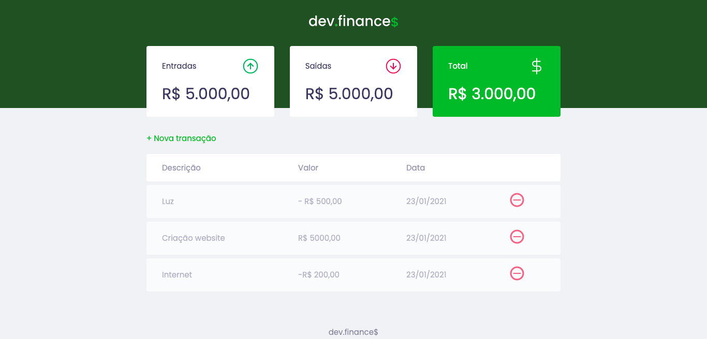

<div align="center">
    <h1 align="center">dev.finance$</h1>
    <p>Aplicação de controle de financeiro, desenvolvida durante a Maratona Discover</p>
    
</div>


<h1 align="center">
  <a href="https://cleilsonandrade.github.io/dev.finances">Acessar demonstração</a>
</h1>


## Índice

* [Descrição](#descrição)
* [Features](#features) 
* [Techs](#techs)
* [Design](#design)
  * [Cores](#cores)
  * [Tipo de fonte](#tipo-de-fonte)
* [Instalação](#instalação)
* [Links Contato](#links-contato)
* [Licença](#licença)

# Descrição
Aplicação de controle financeiro, desenvolvida durante a Maratona Discover realizada pela [@Rocketseat](https://github.com/Rocketseat)

## Features:
- [x] Cadastro de novas transações com descrição, valor e data<br>
- [x] Valor total atualizado do saldo de entradas/saídas das transações<br>
- [x] Valor total atualizado do saldo atual<br>
- [x] Exclusão de transações, atualizando os saldos (entradas, saídas e saldo atual)<br>
- [x] Modal para cadastro de novas transações<br>
- [x] Compatibilidade mobile<br>
- [x] Responsividade<br>

# Techs: 
- **HTML**
- **CSS**
- **JavaScript**

# Design:
- O modelo final para desktop e mobile está disponível na pasta `./design`
- Imagens disponíveis na pasta `./assets`<br>

## Cores:
- Dark-blue: #363f5f<br>
- Green: #49AA26<br>
- Light-green: #3dd705<br>
- Red: #e92929<br>
- White: #f0f2f5<br>

## Tipo de fonte:
- **Poppins**

# Instalação:
```bash
  # Clone este repositório:
  $ git clone https://github.com/CleilsonAndrade/dev.finances.git
  $ cd ./dev.finances
```

# Links Contato
- **Linkedin:** https://www.linkedin.com/in/cleilson-andrade/<br>
- **GitHub:** https://github.com/CleilsonAndrade<br>

# Licença
<p align="center"><a href="https://github.com/CleilsonAndrade/dev.finances/blob/master/LICENSE"></a></p>
