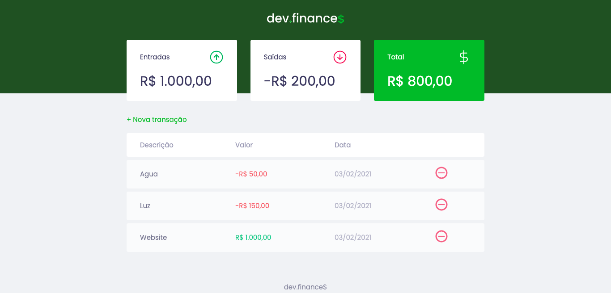

    <h1 align="center">dev.finance$</h1>
    

## Índice

* [Descrição](#descrição)
* [Features](#features) 
* [Techs](#techs)
  * [Modelo](#modelo)
  * [Tipo de fonte](#tipo-de-fonte)
* [Instalação](#instalação)
* [Links Contato](#links-contato)
* [Licença](#licença)

# Descrição
Aplicação de controle de financeiro, desenvolvida durante a Maratona Discover realizada pela <a href="https://github.com/Rocketseat">@Rocketseat</a>

## Features:
- [x] Cadastro de novas trasações com descrição, valor e data 
- [x] Valor total atualizado do saldo de entradas/saídas das trasações 
- [x] Valor total atualizado do saldo atual 
- [x] Exclusão de transações, atualizando os saldos (entradas, saídas e saldo atual) 
- [x] Modal para cadastro de novas transações 
- [x] Responsividade 

# Techs: 
- HTML
- CSS
- JavaScript

## Modelo:
- O modelo final para desktop e mobile está disponível na pasta `./design`

## Tipo de fonte:
- Poppins

# Instalação:
Clone este repositório: 
`git clone https://github.com/CleilsonAndrade/dev.finances.git` 
`cd dev.finances/`

# Links Contato
- Linkedin: https://www.linkedin.com/in/cleilson-andrade/ 
- GitHub: https://github.com/CleilsonAndrade 

# Licença

